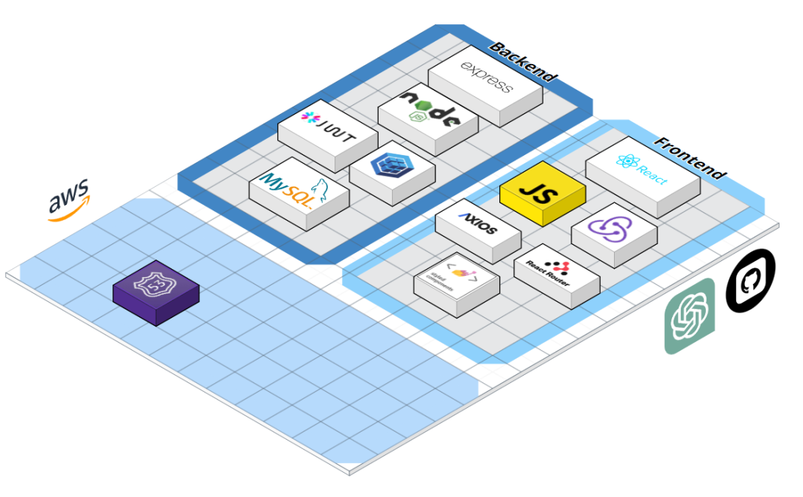
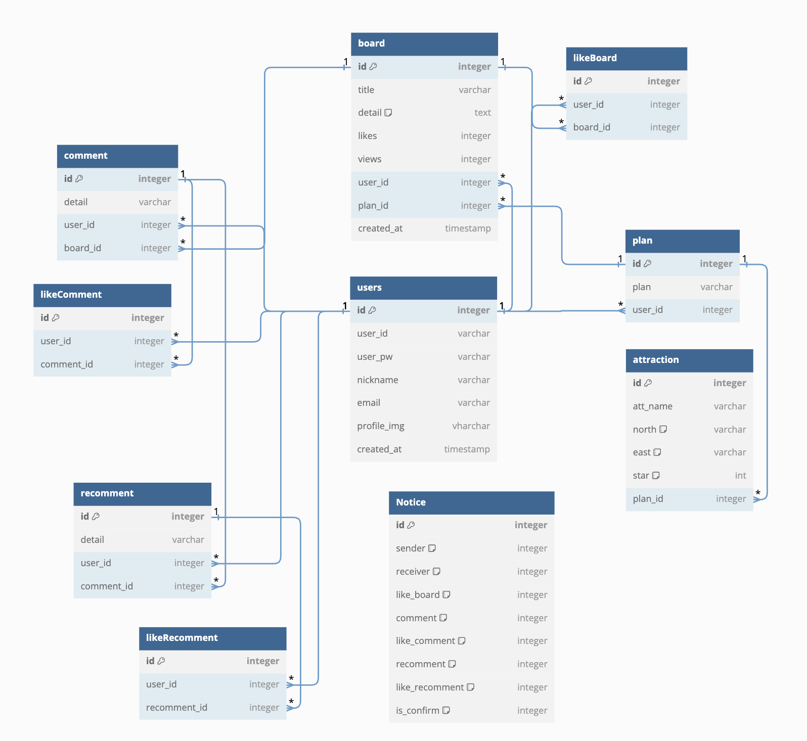

<!-- 1. 처음에 초기화할때 back / models / index.js createAdminUser(); 주석하고 node app.js 해주기 -->

## 간단요약
GPT API와 구글맵 API을 이용한 관광명소의 정보, 지도를 보여주는 사이트를 제작

## 배포사이트 <a href="https://www.hyunss.com" target="_blank">❤</a> 

## 프로젝트 일시
2023년 07월 28일 ~ 2023년 08월 28일

## 목적
1. 트리플 여행 앱 아이디어에 AI를 접목하여 개개인의 취향에 맞는 여행 플랜을 제공하기
2. AI 추천만으로는 여행지 수에 한계가 있기 때문에 Google Maps API를 통해 주변 관광지 추천까지 더해 사용자 선택의 폭을 넓히기

## 사용스택

## ERD

